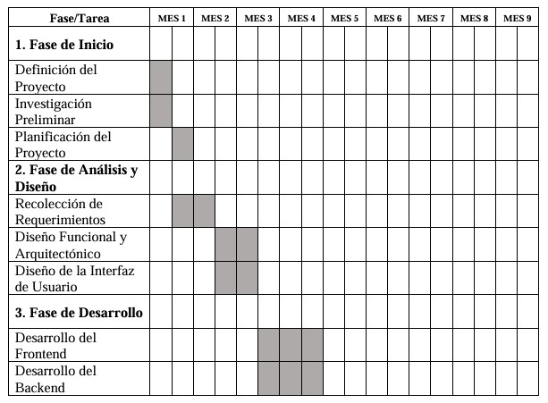
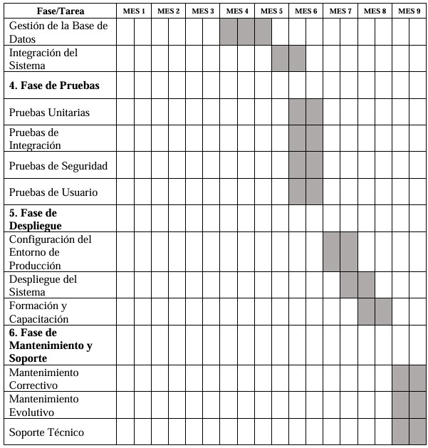

# ACTIVIDAD 2 - DOCUMENTO DE FORMULACIÓN DEL PROYECTO 

**Autores**:
- María Alejandra Boada Rodriguez
- Kevin Andres Molina Barrios
- Santiago Nicolas Briñez García

**Institución**:  
Corporación Universitaria Iberoamericana  
**Programa**: Ingeniera de Software  
**Asignatura**: Proyecto de Software  
**Docente**: Jaime Arevalo

---

## Tabla de Contenido
1. [UPVISION](#upvision)  
2. [Descripción del problema](#descripción-del-problema)  
3. [Alcance del Proyecto](#alcance-del-proyecto)  
4. [Funcionalidades Principales](#funcionalidades-principales)  
5. [Requerimientos Técnicos](#requerimientos-técnicos)  
6. [Limitaciones](#limitaciones)  
7. [Estructura del Desglose](#estructura-del-desglose)  
8. [Objetivos](#objetivos)  
   - [General](#general)  
   - [Específicos](#específicos)  
9. [Matriz de riesgos](#matriz-de-riesgos)  
10. [Cronograma](#cronograma)  
11. [Presupuesto](#presupuesto)  
    - [Presupuesto de Hardware](#presupuesto-de-hardware)  
    - [Presupuesto de Software](#presupuesto-de-software)  
    - [Presupuesto de Personal](#presupuesto-de-personal)  
    - [Presupuesto de Infraestructura](#presupuesto-de-infraestructura)  
12. [Bibliografía](#bibliografía)
    
---

# UPVISION

## Descripción del problema

La falta de inversión en Colombia afecta significativamente el desarrollo de proyectos de emprendimiento e innovación, como se observa en varias investigaciones que analizan la situación de diferentes regiones del país.

Por ejemplo, en Cauca, la creación del ecosistema de emprendimiento CreaTIC fue una respuesta a la necesidad de impulsar una región que, entrando en el siglo XXI, mantenía una estructura económica clásica y con una tasa de disolución de empresas mayor a la de constitución de nuevas sociedades. A pesar de que el surgimiento de CreaTIC representa un avance, se destaca que la alta rotación de emprendimientos y la consolidación de empresas se produjo solo después de la redistribución de recursos provenientes de las regalías mineras, lo que indica la importancia de una inversión adecuada para fortalecer el sector (Martínez et al., 2019).

A nivel nacional, Vesga (2019) enfatiza que el emprendimiento y la innovación en Colombia se encuentran en una posición compleja, ya que el país aún no ha logrado activar plenamente el potencial de las personas, empresas y el contexto macroeconómico necesario para alcanzar niveles de emprendimiento innovador comparables con países más desarrollados. La falta de políticas públicas efectivas, una infraestructura adecuada, acceso al capital y una cultura de toma de riesgos son factores que contribuyen a la limitada inversión en innovación y emprendimiento, lo que reduce la capacidad del país para crecer y competir globalmente (Vesga, 2008).

Adicionalmente, la innovación social y el emprendimiento inclusivo en Colombia también se ven limitados por la falta de inversión y apoyo sostenido por parte de los gobiernos locales y el sector privado. El análisis de Jiménez Coronado et al. (2018) subraya que, aunque existen diversas acciones para promover el emprendimiento social y el desarrollo económico en poblaciones vulnerables, estas iniciativas se ven restringidas por la visión predominante del emprendimiento orientado al beneficio económico más que social, así como por la falta de incentivos y claridad en las políticas públicas que puedan fomentar la sostenibilidad y el crecimiento de estos proyectos (Coronado et al., 2018).

En resumen, la falta de inversión afecta el desarrollo de proyectos de emprendimiento en Colombia al limitar el acceso a recursos financieros, apoyo institucional y políticas efectivas que impulsen el crecimiento de emprendimientos innovadores y sociales. Este panorama sugiere la necesidad de implementar estrategias integrales que promuevan un entorno más favorable para la innovación y el emprendimiento en todos los niveles: individual, organizacional y macroeconómico.

---

## Alcance del Proyecto

El alcance del proyecto abarca la creación de una plataforma web que permita a emprendedores y creadores publicar proyectos innovadores o ideas de negocio, así como facilitar la interacción con patrocinadores interesados en financiar estas iniciativas, a través de esta plataforma, los usuarios podrán conectarse, donar y colaborar en tiempo real con los creadores de los proyectos.

---

## Funcionalidades Principales

**Gestión de Usuarios**:
- Registro y autenticación de usuarios (creadores y patrocinadores).
- Perfiles personalizados que permiten a los creadores mostrar sus proyectos y a los donantes llevar un registro de sus contribuciones.

**Publicación de Proyectos**:
- Herramientas para que los creadores suban y gestionen proyectos, incluyendo detalles como descripciones, imágenes, videos y metas.
- Categorías de proyectos para una navegación eficiente.
- Sistema de recompensas para los patrocinadores según su nivel de apoyo.

**Donaciones y Financiamiento**:
- Integración de pasarelas de pago seguras para realizar donaciones.
- Visualización del progreso de financiación y reportes de uso de los fondos por parte de los creadores.

**Comunicación y Colaboración**:
- Mensajería interna para la comunicación directa entre creadores y patrocinadores.
- Actualizaciones periódicas de los creadores sobre el progreso del proyecto.
- Sistema de comentarios para proporcionar feedback.

**Seguridad y Privacidad**:
- Encriptación de datos y autenticación en dos pasos para la protección de cuentas y transacciones.
- Opciones de donaciones anónimas para los patrocinadores.

**Monitoreo y Reportes**:
- Panel administrativo para el monitoreo de la plataforma, incluyendo estadísticas de proyectos, donaciones y comportamiento de usuarios.
- Generación de reportes detallados sobre actividades de los usuarios.

---

## Requerimientos Técnicos

- **Frontend**: Desarrollo con tecnologías web modernas como HTML5, CSS3, JavaScript.
- **Backend**: Implementación de APIs RESTful utilizando lenguajes como Node.js, Java o Python, junto con bases de datos relacionales como MySQL y MongoDB.
- **Infraestructura**: La plataforma se desplegará en servicios de la nube como AWS o Azure, asegurando escalabilidad y alta disponibilidad mediante el uso de contenedores y orquestadores.

## Limitaciones

- Dependencia de pasarelas de pago externas para las transacciones.
- No se garantiza el éxito de los proyectos, únicamente se ofrece la plataforma para su visibilización y financiamiento.

Este es el alcance que delimita las funcionalidades, requerimientos técnicos, y tiempos de entrega para el desarrollo de la plataforma.

---

## Estructura del Desglose

La Estructura del Desglose del Trabajo (EDT) detalla las tareas y subtareas necesarias para la creación y entrega del proyecto, dividiéndolas en fases claras y manejables.

### Fase de Inicio

1. **Definición del Proyecto**
   - Identificación de los requerimientos del cliente.
   - Establecimiento de los objetivos y alcances del proyecto.
   - Documentación inicial del proyecto.

2. **Investigación Preliminar**
   - Análisis de mercado.
   - Revisión de tecnologías aplicables y mejores prácticas.
   - Estimación preliminar de costos y recursos.

3. **Planificación del Proyecto**
   - Elaboración del cronograma del proyecto.
   - Definición del presupuesto.
   - Asignación de roles y responsabilidades del equipo de trabajo.

### Fase de Análisis y Diseño

1. **Recolección de Requerimientos**
   - Reuniones con stakeholders para definir necesidades específicas.
   - Elaboración del documento de especificación de requerimientos.

2. **Diseño Funcional y Arquitectónico**
   - Diseño de la arquitectura del sistema.
   - Diseño de la base de datos.
   - Elaboración de diagramas UML.

3. **Diseño de la Interfaz de Usuario**
   - Creación de wireframes y mockups de las páginas principales.
   - Diseño de la experiencia de usuario para garantizar la usabilidad.
   - Diseño adaptable para dispositivos móviles.

### Fase de Desarrollo

1. **Desarrollo del Frontend**
   - Implementación de la estructura de las páginas con HTML, CSS y JavaScript.
   - Programación de las interfaces interactivas con frameworks.
   - Integración de funciones de autenticación y gestión de perfiles de usuarios.

2. **Desarrollo del Backend**
   - Implementación del servidor y creación de APIs RESTful.
   - Conexión con la base de datos y desarrollo de la lógica de negocio.
   - Integración con servicios de pago y mensajería interna.

3. **Gestión de la Base de Datos**
   - Creación de tablas, relaciones y procedimientos almacenados en la base de datos.
   - Configuración de la conexión segura entre el servidor y la base de datos.
   - Optimización de consultas para mejorar el rendimiento.

4. **Integración del Sistema**
   - Sincronización entre el frontend y el backend mediante APIs.
   - Pruebas de integración para asegurar la correcta comunicación entre módulos.
   - Ajustes de seguridad en la interacción con servicios externos.

### Fase de Pruebas

1. **Pruebas Unitarias**
   - Desarrollo de pruebas unitarias para cada módulo del sistema.
   - Verificación de que las funcionalidades individuales cumplen con los requerimientos.

2. **Pruebas de Integración**
   - Pruebas de interacción entre los diferentes componentes del sistema.
   - Pruebas de integración con pasarelas de pago y servicios de mensajería.

3. **Pruebas de Seguridad**
   - Verificación de la encriptación de datos y manejo seguro de la información personal.
   - Pruebas de autenticación de usuarios y control de acceso.

4. **Pruebas de Usuario**
   - Ejecución de pruebas con usuarios reales para asegurar la usabilidad.
   - Recolección de feedback de los usuarios sobre la experiencia en la plataforma.

### Fase de Despliegue

1. **Configuración del Entorno de Producción**
   - Configuración de servidores en la nube.
   - Implementación de medidas de escalabilidad y alta disponibilidad.
   - Configuración de sistemas de backup y recuperación de datos.

2. **Despliegue del Sistema**
   - Publicación del sitio web en producción.
   - Monitoreo inicial del comportamiento del sistema y optimización según sea necesario.

3. **Formación y Capacitación**
   - Capacitación a los administradores de la plataforma sobre la gestión y monitoreo del sistema.
   - Provisión de documentación detallada para el uso y mantenimiento de la plataforma.

### Fase de Mantenimiento y Soporte

1. **Mantenimiento Correctivo**
   - Identificación y corrección de errores o bugs reportados por los usuarios.
   - Parcheo de vulnerabilidades de seguridad según sea necesario.

2. **Mantenimiento Evolutivo**
   - Implementación de nuevas funcionalidades solicitadas por los usuarios.
   - Mejora continua de la interfaz de usuario y la experiencia de uso.

3. **Soporte Técnico**
   - Provisión de soporte técnico a usuarios y administradores a través de tickets o sistema de chat.
   - Actualizaciones regulares del sistema para mantener su óptimo funcionamiento.

Esta estructura del desglose detalla cada fase del proyecto, asegurando una correcta gestión del trabajo y cumplimiento de los plazos de entrega para la creación de la plataforma web.

---

## Objetivos

### General

Desarrollar una plataforma web que impulse el emprendimiento y la innovación en Colombia, facilitando la interacción entre emprendedores y patrocinadores, mejorando el acceso a recursos financieros y apoyo institucional para proyectos innovadores y de impacto social.

---

### Específicos

1. Proporcionar una plataforma digital que conecte de manera eficiente a emprendedores y patrocinadores, asegurando que la presentación de los proyectos sea clara, ordenada y comprensible, facilitando una comunicación efectiva entre ambos actores. Esto garantizará que los usuarios puedan interactuar de forma ágil y directa, optimizando los resultados de financiamiento.

2. **Reflexión**: Al crear una interfaz amigable y fácil de usar, los emprendedores podrán exponer sus ideas de manera atractiva, incrementando las oportunidades de financiamiento y éxito de sus proyectos.

3. Garantizar la calidad y seguridad en la gestión de la información mediante la implementación de tecnologías avanzadas de encriptación y autenticación con el fin de proteger los datos personales y financieros de los usuarios, fomentando la confianza en la plataforma.

4. **Reflexión**: La seguridad es fundamental para generar credibilidad. Si los patrocinadores sienten que sus datos y transacciones están protegidos, estarán más dispuestos a invertir en los proyectos.

5. Promover la transparencia en el uso de los recursos financieros obtenidos a través de la plataforma, implementando reportes detallados y visibles para los patrocinadores sobre el progreso de los proyectos y el uso de los fondos recaudados.

   **Reflexión**: La transparencia no solo genera confianza, sino que también impulsa la responsabilidad social de los emprendedores, lo que podría atraer más financiamiento a largo plazo.

6. Fomentar la interacción continua y colaborativa entre los emprendedores y patrocinadores mediante la implementación de sistemas de mensajería y feedback, asegurando que haya un flujo de comunicación claro y organizado en todo momento.

   **Reflexión**: Una buena comunicación permite la co-creación y ajuste de proyectos en función de las sugerencias de los patrocinadores, lo que podría mejorar la calidad y viabilidad de los mismos.

7. Mejorar continuamente la experiencia del usuario en la plataforma, aplicando pruebas de usabilidad y análisis de feedback para identificar áreas de mejora, asegurando que la plataforma cumpla con las expectativas de ambos usuarios: emprendedores y patrocinadores.

   **Reflexión**: La experiencia del usuario es clave para la retención y el crecimiento de la comunidad. Un diseño basado en feedback y mejora continua garantizará el éxito a largo plazo del proyecto.

---

## Matriz de Riesgos

La matriz se organiza en una tabla con cuatro niveles de probabilidad (Baja, Media, Alta, Muy Alta) y cuatro niveles de impacto (Bajo, Moderado, Alto, Crítico).

| Impacto / Probabilidad | Baja           | Media          | Alta           | Muy Alta       |
|------------------------|----------------|----------------|----------------|----------------|
| **Crítico**            | Riesgo moderado| Riesgo alto    | Riesgo muy alto| Riesgo extremo |
| **Alto**               | Riesgo bajo    | Riesgo moderado| Riesgo alto    | Riesgo muy alto|
| **Moderado**           | Riesgo bajo    | Riesgo bajo    | Riesgo moderado| Riesgo alto    |
| **Bajo**               | Riesgo bajo    | Riesgo bajo    | Riesgo bajo    | Riesgo moderado|

---

### Riesgos Identificados

1. **Riesgo Financiero**:
   - **Descripción**: Dificultades para obtener o gestionar el financiamiento necesario para el desarrollo de la plataforma.
   - **Probabilidad**: Media.
   - **Impacto**: Crítico.
   - **Clasificación**: Riesgo muy alto.

2. **Riesgo de Seguridad de Datos**:
   - **Descripción**: Vulnerabilidad en la protección de la información personal y financiera de los usuarios.
   - **Probabilidad**: Baja.
   - **Impacto**: Crítico.
   - **Clasificación**: Riesgo moderado.

3. **Riesgo Tecnológico**:
   - **Descripción**: Fallos en la integración de pasarelas de pago o en la infraestructura de la nube.
   - **Probabilidad**: Media.
   - **Impacto**: Alto.
   - **Clasificación**: Riesgo alto.

4. **Riesgo de Usabilidad**:
   - **Descripción**: Que la plataforma no sea lo suficientemente intuitiva para los usuarios (emprendedores o patrocinadores).
   - **Probabilidad**: Alta.
   - **Impacto**: Moderado.
   - **Clasificación**: Riesgo moderado.

5. **Riesgo de Cumplimiento Legal**:
   - **Descripción**: Falta de cumplimiento con las normativas locales o internacionales relacionadas con la protección de datos y las transacciones.
   - **Probabilidad**: Baja.
   - **Impacto**: Alto.
   - **Clasificación**: Riesgo bajo.

### Plan de Mitigación

- **Riesgo Financiero**: Establecer un plan financiero claro y buscar fuentes de financiamiento diversificadas (inversionistas, donaciones).
- **Riesgo de Seguridad de Datos**: Implementar auditorías de seguridad periódicas y actualizar protocolos de seguridad.
- **Riesgo Tecnológico**: Realizar pruebas continuas de la infraestructura y las pasarelas de pago.
- **Riesgo de Usabilidad**: Hacer pruebas con usuarios durante las fases de desarrollo y ajustar la interfaz según el feedback.
- **Riesgo de Cumplimiento Legal**: Consultar con expertos legales en protección de datos y legislación en transacciones digitales.

---

## Cronograma

---

## Presupuesto

### Presupuesto de Hardware

| Descripción                               | Precio Unitario ($) | Cantidad | Precio Total (COP) |
|-------------------------------------------|---------------------|----------|--------------------|
| Ordenador Portátil para Desarrollo        | 800.000             | 4        | 3.200.000          |
| Servidor para Despliegue y Pruebas        | 1.200.000           | 2        | 2.400.000          |
| Switch Ethernet para conexión en red      | 200.000             | 4        | 800.000            |
| Router con soporte VPN para pruebas       | 150.000             | 5        | 750.000            |
| UPS para soporte de energía               | 250.000             | 6        | 1.500.000          |
| **Total Hardware**                        |                     |          | **8.650.000**      |

**Nota**: Los precios pueden variar según la marca y especificaciones del hardware.

### Presupuesto de Software

| Descripción                                             | Precio Unitario ($) | Cantidad | Precio Total (COP) |
|---------------------------------------------------------|---------------------|----------|--------------------|
| Licencia Sistema Operativo Windows/Linux para Servidor  | 150.000             | 4        | 600.000            |
| IDE (Visual Studio Code, WebStorm, u otro)              | 100.000             | 4        | 400.000            |
| Licencia de Base de Datos MySQL/MongoDB (opcional)      | 200.000             | 4        | 800.000            |
| Herramienta de Diseño (Figma, Adobe XD, u otra)         | 100.000             | 2        | 200.000            |
| Suscripción a Servicios de Nube (AWS, Azure) (mensual)  | 600.000             | 1        | 600.000            |
| **Total Software**                                      |                     |          | **2.600.000**      |

**Nota**: Los costos de servicios en la nube están estimados para un uso moderado durante el desarrollo y pruebas del proyecto.

### Presupuesto de Personal

| Cargo                  | Cantidad de Meses | Precio Mensual ($) | Precio Total (COP) |
|------------------------|-------------------|--------------------|--------------------|
| Gerente de Proyecto    | 5                 | 5.000.000          | 25.000.000         |
| Desarrollador Frontend | 5                 | 3.500.000          | 17.500.000         |
| Desarrollador Backend  | 5                 | 3.500.000          | 17.500.000         |
| Diseñador UX/UI        | 3                 | 2.800.000          | 8.400.000          |
| Analista de Calidad    | 6                 | 3.500.000          | 21.000.000         |
| **Total Personal**     |                   |                    | **89.400.000**     |

### Presupuesto de Infraestructura

| Concepto                                      | Precio Mensual ($) | Cantidad de Meses | Precio Total (COP) |
|-----------------------------------------------|--------------------|-------------------|--------------------|
| Espacio de oficina (renta)                    | 5.000.000          | 5                 | 25.000.000         |
| Servicios públicos (internet, electricidad)   | 2.000.000          | 5                 | 10.000.000         |
| Mantenimiento y Limpieza                      | 1.900.000          | 5                 | 9.500.000          |
| **Total Infraestructura**                     |                    |                   | **44.500.000**     |

---

## Bibliografía

- Martínez, W. F. R., & Pazos, J. R. C. (2019). *Ecosistema de emprendimiento e innovación en Cauca, Colombia*. Experiencia desde el Centro de Desarrollo Tecnológico CreaTIC. Revista Venezolana de Gerencia, 24(87), 922-937.
- Vesga, R. (2008). *Emprendimiento e innovación en Colombia: ¿Qué nos está haciendo falta*. Observatorio de Competitividad del Centro de Estrategia y Competitividad. Recuperado el, 3.
- Coronado, A. J., Palma, H. G. H., & Redondo, R. P. (2018). *Emprendimiento social y su repercusión en el desarrollo económico desde los negocios inclusivos (Colombia)*. Revista Logos, Ciencia & Tecnología, 10(2), 198-211.
- Pressman, Roger S. (2021). *Ingeniería de software*. McGraw-Hill Interamericana. Capítulos 24, 25, 26, páginas 490-548.
- Omaña, M. (2012). *Manufactura esbelta: una contribución para el desarrollo de software con calidad*. Red Enlace, páginas 14-18.
- Sommerville, I. (2005). *Ingeniería del software*. Pearson Educación.

